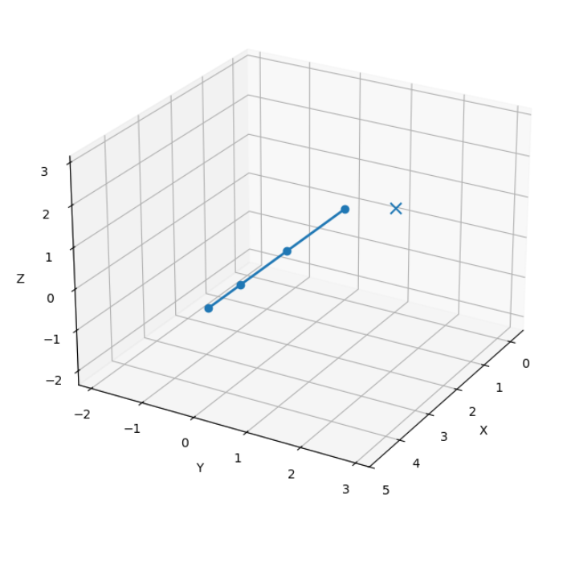
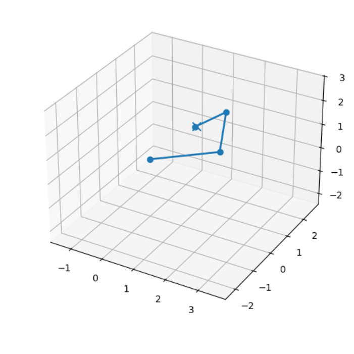

# Planejador de Cinemática Inversa 3D (CCD)

>  **Projeto em desenvolvimento**

Este projeto implementa um **planejador de cinemática inversa (Inverse Kinematics – IK)** para um braço robótico em **3D**, utilizando o algoritmo **CCD (Cyclic Coordinate Descent)**, desenvolvido inteiramente em **Python**.

O simulador permite visualizar o braço como uma sequência de **segmentos de reta**, definir um **alvo no espaço 3D** e calcular iterativamente as rotações das juntas para que a ponta do braço se aproxime do alvo.

---

##  Funcionalidades

- Cinemática inversa em **3D** usando **CCD**
- Representação do braço como segmentos rígidos
- Visualização interativa em **Matplotlib 3D**
- Definição dinâmica do alvo 

---

##  Conceitos Utilizados

- **Cinemática Direta (Forward Kinematics)**
- **Cinemática Inversa (Inverse Kinematics)**
- **Cyclic Coordinate Descent (CCD)**
- **Quaternions** para rotação no espaço 3D
- Álgebra vetorial (produto vetorial, normalização, projeções)

---

##  Exemplos Visuais

### 🔹 Configuração inicial do braço

O braço parte de uma configuração inicial reta, sem tentativa de alcançar o alvo.



---

### 🔹 Resultado após o planejamento (CCD)

Após a execução do algoritmo CCD, as juntas são rotacionadas iterativamente para aproximar a ponta do braço do alvo.



---

##  Dependências

- Python **3.10+**
- `numpy`
- `matplotlib`
- Backend gráfico compatível (`TkAgg` ou `Qt5Agg`)

Instalação rápida:

```bash
pip install numpy matplotlib
```

---

##  Execução

```bash
python arm_planner.py
```

Ao executar:
- Uma janela 3D será aberta
- O alvo pode ser movido
- O botão **Plan** executa o CCD

---

##  Status do Projeto

- ✅ CCD funcional em 3D
- ✅ Visualização gráfica

---

##  Próximos Passos

- Suporte a **comprimentos diferentes por segmento**
- Limites de junta
- Detecção de colisões

---

🛠️ *Este projeto é experimental e tem fins educacionais.*

